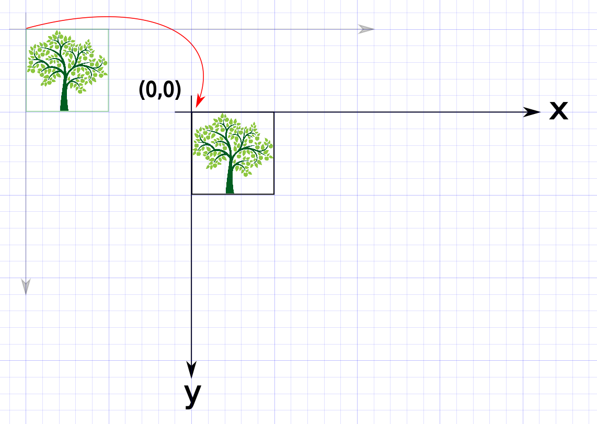
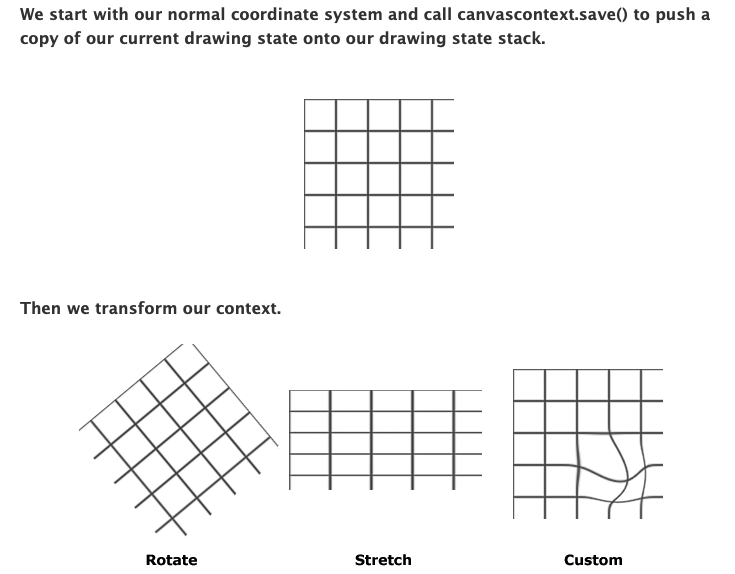
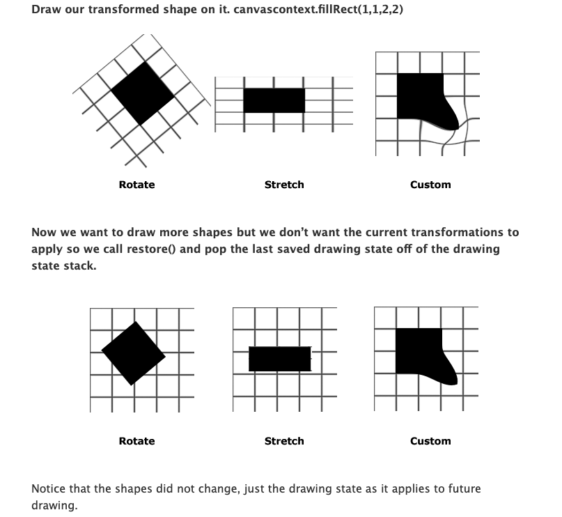
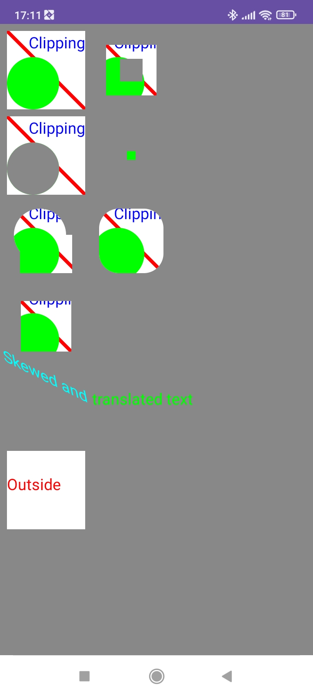

# ViewClipping
A demo project for various views clipping. 

## Key Concepts - 2D Graphics
 1. `Canvas.translate()` - translate the canvas to a new position, instead of re-calculating and re-drawing the objects.
 
    
   - [Courtesy of SO](https://stackoverflow.com/a/25497008/7478839)

2. `Canvas.save()` and `Canvas.restore()` - save the current state of the canvas, and restore it later.
   - Reversing a transformation by applying another transformation is prone to errors
   
   
   - [Courtesy of Litten](https://html5.litten.com/understanding-save-and-restore-for-the-canvas-context/)
   
3. `quickReject()` - check whether the rectangle is outside the bounds of the canva, useful when constructing complex shapes and nned to do as fast as possible.
   - With this, you can decide efficiently which objects you do not have to draw at all, and there is no need to write intersection logic.

## Screenshot

